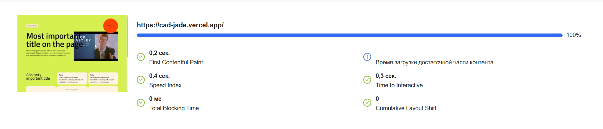

## Commands  

```bash
# directory is regenerated after each dependency installation.
npm run prepare
# runs the project in development mode
npm run dev
# builds a project
npm run build
# runs the assembled project
npm run start
# runs lint code 
npm run lint -- --fix
```


## Stack
- next (app router)
- ts
- panda css
- radix (form)
- classnames
- react-player
- eslint
- prettier


## Solutions

### Header

Header ```pointerEvents: 'none'``` do not overlap empty space contents, Children ```pointerEvents: 'all'``` overlap content
```isDefaultBase``` changes the button to the default button on mobile
```jsx
<header
    className={css({
        ...
        pointerEvents: 'none',
        ...
    })}
    ...
>
<Logo
    className={css({
        pointerEvents: 'all',
    })}
/>
<nav>
    <Btn
        href="/contact"
        className={css({
            pointerEvents: 'all',
        })}
        isCircle
        isDefaultBase
    >
        Contact us
    </Btn>
</nav>
</header>
```

### Btn

In the panda documentation they suggest using sva, but i use ```classnames``` which allows using ```css```

- ```isCircle``` round button
- ```isDefaultBase``` round button from 820px, to 820px default btn. Used in conjunction with ```isCircle```
- ```isLoading``` disabled button and jump btn

```jsx
classNames(
    className,
    css({
        cursor: 'pointer',
        display: 'block',
        textAlign: 'center',
        pt: 4,
        pl: 5,
        pr: 5,
        pb: '14px',
        textStyle: 'btnText',
        transition: 'background-color .6s 0s, opacity .6s 0s',
        rounded: '999px',
    }),
    {
        [css(circleStyle)]: isCircle && !isDefaultBase,
        [css({ lg: circleStyle })]: isCircle && isDefaultBase,
        [css({
            animation: 'bounce 1s infinite',
        })]: isLoading && !disabled,
        [css({
            bgColor: 'disabledBtn',
        })]: isLoading || disabled,
        [css({
            bgColor: {
                base: 'action',
                _hover: 'actionHover',
                _focus: 'actionHover',
                _active: 'actionActive',
            },
        })]: !isLoading && !disabled,
    },
)
```

disabled btn

```jsx
...
[css({
    bgColor: 'disabledInput',
})]: isLoading || disabled,
...
<btn ... disabled={isLoading || disabled} ... />
```

## Section 

All section is linked to the title via id title

```jsx
<Section aria-labelledby={...}>
    <Title id={...} as="h1">
    ....
```

## Title

Header Component. The props ```as``` are responsible for level tag. The props ```size``` are responsible for level style

```jsx
import { AreaHTMLAttributes, createElement, FC } from 'react'
import { css } from '../../styled-system/css'
import classNames from 'classnames'

const styles = {
    h1: css({
        textStyle: 'title',
    }),
    h2: css({
        textStyle: 'heading',
    }),
    h3: css({
        textStyle: 'subtitle',
    }),
}

interface TitleProps extends AreaHTMLAttributes<HTMLParagraphElement> {
    as?: 'h1' | 'h2' | 'h3'
    size?: 'h1' | 'h2' | 'h3'
}

const Title: FC<TitleProps> = ({
    children,
    as = 'h2',
    size = as,
    className,
    ...props
}) => {
    return createElement(
        as,
        {
            className: classNames(className, styles[size]),
            ...props,
        },
        children,
    )
}

export default Title
```

## Input & text-arear

- ```isLoading``` disabled button and jump btn

```jsx
classNames(
    className, 
    css({
        rounded: '888px',
        color: 'text',
        transition: 'background-color .6s 0s, opacity .6s 0s',
        py: 4,
        px: 5,
        textStyle: 'text',
        '&::placeholder': {
            color: 'placeholder',
            textStyle: 'text',
        },
    }), 
    {
        [css({
            bgColor: {
                base: 'card',
                _hover: 'actionHover',
                _focus: 'actionHover',
            },
        })]: !isLoading,
        [css({
            animation: 'bounce 1s infinite',
        })]: isLoading && !disabled,
        [css({
            bgColor: 'disabledInput',
        })]: isLoading || disabled,
    }
)
```

style placeholder

```jsx
'&::placeholder': {
    color: 'placeholder',
    textStyle: 'text',
},
```

- ```base``` no state
- ```_hover``` state hover
- ```_focus``` state focus

```jsx
bgColor: {
    base: 'card',
    _hover: 'actionHover',
    _focus: 'actionHover',
},
```

disabled input

```jsx
...
[css({
    bgColor: 'disabledInput',
})]: isLoading || disabled,
...
<input ... disabled={isLoading || disabled} ... />
```

## body

the footer is pinned to the bottom of the page

```jsx
const styles = css({
    ...
    minH: '100vh',
    display: 'grid',
    gridTemplateColumns: '1fr',
    gridTemplateRows: '1fr min-content',
})
```

## Check redirect

The code checks if the user was redirect

```jsx
...
const headersList = await headers()
const referer = headersList.get('referer')
if (!referer || !referer.match(/\/contact(\/?)$/g)) {
    redirect('/contact')
}
...
```


## form wrap

sva create list classes

```jsx
const fields = sva({
    slots: ['field', 'wrap', 'message', 'label'],
    base: {
        field: {
            display: 'flex',
            justifyContent: 'space-between',
            flexDir: 'column',
            gap: 2,
        },
        message: { color: 'red' },
        label: {},
        wrap: {
            display: 'flex',
            flexDir: 'column',
            gap: 2,
        },
    },
})
...
<Field className={classNames(className, classes.field)} name={name}>
    <div className={classes.wrap}>
        <Label className={classes.label}>{label!}</Label>
        <Control asChild>{children}</Control>
    </div>
    {messages.map((el, i) => (
        <Message className={classes.message} key={i} match={el.match}>
            {el.children}
        </Message>
    ))}
</Field>
...
```

## intro 

```maxW: '540px'``` overlays a title on top of the video

```jsx
<div
    className={css({
        display: 'flex',
        flexDir: {
            base: 'column',
            lg: 'row',
            xl: 'column',
        },
        gap: {
            base: 5,
            lg: 10,
            xl: 5,
        },
        zIndex: 2,
        xl: {
            maxW: '540px',
        },
    })}
>
    <Title
        className={css({
            w: {
                base: '100%',
                lg: '420px',
                xl: '740px',
            },
            flexShrink: 0,
        })}
        id={idTitleHomeIntro}
        as="h1"
    >
...
```

## less

places the button outside the card borders

```jsx
<Card
    className={css({
        w: '100%',
        minH: '140px',
        pos: 'relative',
        textAlign: 'center',
        display: 'flex',
        justifyContent: 'center',
        alignItems: 'center',
    })}
>
...
    <Btn
        className={css({
            pos: 'absolute',
            bottom: {
                base: '-160px',
                lg: '-140px',
            },
            right: {
                base: '2vw',
                lg: '10vw',
            },
        })}
        isCircle
    >
...
```

## contact form

sva create list classes.
grid list

```jsx
...
const classes = sva({
    slots: ['root', 'textareae', 'btn'],
    base: {
        root: {
            display: 'grid',
            gridTemplateColumns: '1fr',
            gridTemplateRows: 'min-content min-content min-content min-content',
            gap: 5,
            lg: {
                gridTemplateColumns: '1fr 1fr',
                gridTemplateRows:
                    'min-content min-content minmax(200px, min-content)',
            },
        },
        textareae: {
            lg: {
                gridColumn: '2/3',
                gridRow: '1/4',
            },
        },
        btn: {
            w: '100%',
            lg: {
                gridColumn: '1/2',
                gridRow: '3/4',
                alignSelf: 'self-end',
            },
        },
    },
})
...
```
